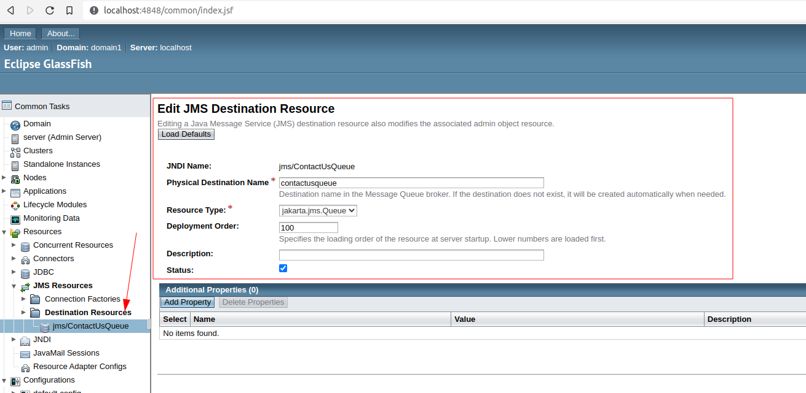
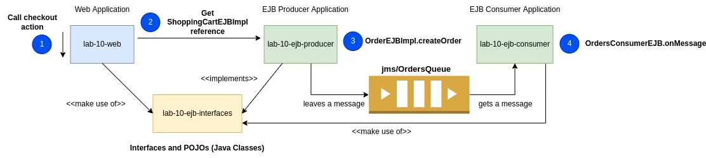

# Hands-on session 10: JMS & WebSockets

In this session, the next topics are covered:

- Java Enterprise Application - JMS Project
- Step 1: creating a queue in Glassfish
- Step 2: defining the interfaces - pojos project
- Step 3: defining the EJB Producer Application project
- Step 4: defining the EJB Consumer Application project
- Step 5: defining the Web Application project
- Step 6: deployment in Glassfish
- Strategies for getting updates from the server
- WebSockets - definition
- WebSockets - architecture
- WebSockets client side
- WebSockets server side


## Required software

For this session it is required to have installed:

- Java SDK 11. (*)
- Apache Maven 3.x version. (*)
- [Glassfish 6.2.5](https://www.eclipse.org/downloads/download.php?file=/ee4j/glassfish/glassfish-6.2.5.zip) version.
- An IDE (IntelliJ, Eclipse, Netbeans)

Also, do not forget to define the following environment variables:

- `M2_HOME` -> root directory of your Maven installation.
- `JDK_HOME` -> root directory of your JDK installation.
- Update the `PATH` environment variable by adding the `bin` directories of your JDK and Maven installations.

(*) You can avoid doing all these step manually by installing
[SDKMAN](https://sdkman.io/).


## Configuring a New JMS Destination Resource

Create a New JMS Destination Resource with the following information:
- JNDI Name: jms/ContactUsQueue
- Physical Destination Name: contactusqueue
- Resource Type: jakarta.jms.Queue
  

**Now, you are ready to deploy the EJB and Web application projects in Glassfish.**

## Exercise 01: Shopping Cart Checkout

For this exercise, it is required to [restore the database unipi](src/main/java/it/unipi/dsmt/jakartaee/lab_10_ejb/consumer/OrdersConsumerEJB.java), [create a jdbc/BeerPool JDBC Resource](src/main/java/it/unipi/dsmt/jakartaee/lab_10_ejb/consumer/OrdersConsumerEJB.java)
and create a JMS Destination Resource: **jms/OrdersQueue** (similar steps described in the previous point). 
The following image illustrates the interaction between components.



#### 1. When a user clicks on the **checkout** button, a **POST** method call is performed to the ShoppingCartServlet servlet and the orderId generated is shown to the user.

**File: src/main/webapp/WEB-INF/jsp/shopping_cart.jsp**
```javascript
    <script src="https://ajax.googleapis.com/ajax/libs/jquery/3.6.1/jquery.min.js"></script>
    <script type="text/javascript">
        function checkout(){
            params = {action: 'checkout'};
            $.post("${pageContext.request.contextPath}/ShoppingCartServlet", params, function(result){
                alert('Order Id: ' + result);
                window.location.href = window.location.href;
            }).fail(function(xhr, status, error) {
                alert('error');
            });
        }
    </script>
```

#### 2. The ShoppingCartServlet servlet, retrieves a ShoppingCartEJB instance. Next, the checkout method is invoked:

**File: src/main/java/it/unipi/dsmt/javaee/lab_10/servlets/ShoppingCartServlet.java**
```java
  private void checkout(HttpServletRequest request, HttpServletResponse response) throws IOException {
      String productId = request.getParameter("productId");
      String productName = request.getParameter("productName");
      ShoppingCartEJB shoppingCartEJB = retrieveShoppingCartEJB(request);
      String orderId = shoppingCartEJB.checkout();
      response.getWriter().write(orderId + "");
      response.getWriter().flush();
      response.getWriter().close();
  }
```

#### 3. The ShoppingCartEJB EJB has injected a reference of a stateless OrderEJBImpl EJB and the method createOrder is called during the execution of the checkout operation. OrderEJBImpl leaves a message into the OrdersQueue queue to let the warehouse know about this new order.

**File: src/main/java/it/unipi/dsmt/jakartaee/lab_10_ejb/producers/ShoppingCartEJBImpl.java**
```java
    @EJB
    private OrderEJBImpl orderEJB;

    public String checkout(){
        //1. Creating OrderDTO object
        OrderDTO orderDTO = new OrderDTO();
        orderDTO.setBeers(beerDTOList);
        //2. Creating Order by calling the OrderEJB.createOrder method
        String orderId = orderEJB.createOrder(orderDTO);
        //3. Since we created an order, we have to remove all products in our shopping cart
        beerDTOList = new ArrayList<>();
        //4. Returning the orderId generated
        return orderId;
    }
```

**File: src/main/java/it/unipi/dsmt/jakartaee/lab_10_ejb/producers/OrderEJBImpl.java**
```java
package it.unipi.dsmt.jakartaee.lab_10_ejb.producers;

import it.unipi.dsmt.jakartaee.lab_10_ejb_interfaces.dto.OrderDTO;
import jakarta.annotation.Resource;
import jakarta.ejb.Stateless;
import jakarta.inject.Inject;
import jakarta.jms.JMSContext;
import jakarta.jms.Queue;

import java.util.UUID;

@Stateless
public class OrderEJBImpl {

  @Resource(lookup = "jms/OrdersQueue")
  private Queue queue;
  @Inject
  private JMSContext jmsContext;

  public String createOrder(OrderDTO orderDTO){
    //1. Insert OrderDTO into a database
    String id = UUID.randomUUID().toString();
    orderDTO.setId(id);
        /*
            2. Adding the orderDTO object to a queue for further processing.
            For instance: The warehouse will receive this order for preparing
            the products to be delivered.
        */
    jmsContext.createProducer().send(queue, orderDTO);
    return id;
  }

}
```

#### 4. In the consumer project, OrdersConsumerEJB EJB is created to pick up from the queue messages of type OrderDTO.

**File: src/main/java/it/unipi/dsmt/jakartaee/lab_10_ejb/consumer/OrdersConsumerEJB.java**
```java
package it.unipi.dsmt.jakartaee.lab_10_ejb.consumer;

import it.unipi.dsmt.jakartaee.lab_10_ejb_interfaces.dto.ContactUsDTO;
import it.unipi.dsmt.jakartaee.lab_10_ejb_interfaces.dto.OrderDTO;
import jakarta.ejb.ActivationConfigProperty;
import jakarta.ejb.MessageDriven;
import jakarta.jms.JMSException;
import jakarta.jms.Message;
import jakarta.jms.MessageListener;

@MessageDriven(name = "OrdersConsumer",
        activationConfig = {
                @ActivationConfigProperty(propertyName = "destinationLookup", propertyValue = "jms/OrdersQueue"),
                @ActivationConfigProperty(propertyName = "destinationType", propertyValue = "jakarta.jms.Queue")
        })
public class OrdersConsumerEJB implements MessageListener {
  @Override
  public void onMessage(Message message) {
    OrderDTO orderDTO = null;
    try {
      orderDTO = message.getBody(OrderDTO.class);
      System.out.println("Warehouse, receiving order: " + orderDTO);
    } catch (JMSException e) {
      e.printStackTrace();
    }
  }
}
```

## Exercise 02: Chat direct message

The solution will be uploaded Nov 18th.


## Exercise 03: Video Streaming

The solution will be uploaded Nov 18th.